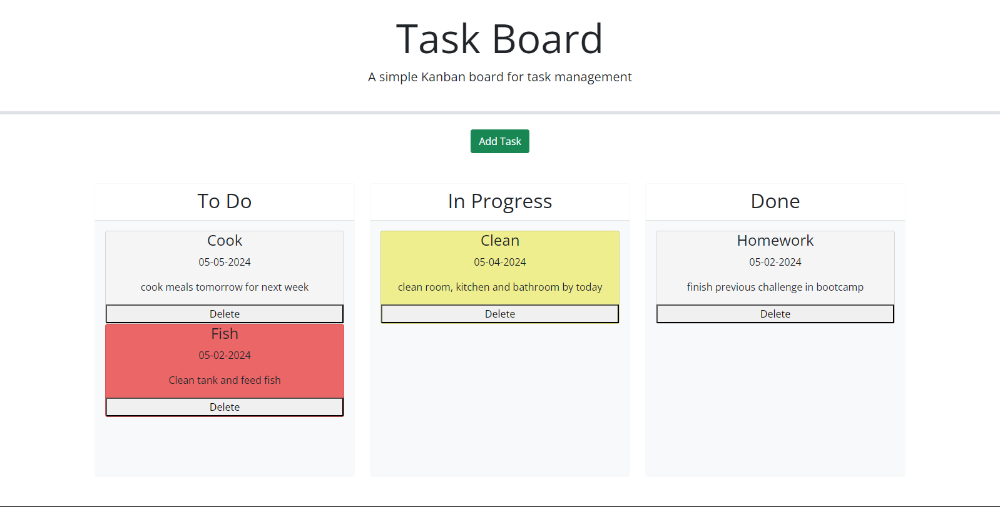

# 5-task-board

## Description

The fifth challenge assignment from a bootcamp where the task was to create a simple task board application. It featured dynamically updated HTML and CSS powered by jQuery.

## Process

The process included adding a modal for inputting task title, due date and description for each task. Day.js was used for the datepicker. When the add task button is clicked, the task card automatically pops into the todo column. Draggable and Droppable events were created to move the task cards bewteen three columns: To-do, In Progress, and Done. A delete button was added to each card to delete a card. The properties for each card is saved in localStorage. When a task is nearing a deadline, it is yellow, or red for overdue.

## Links

Link to website used for this challenge.
https://mackemo.github.io/5-task-board/

Link to public Github repository for this challenge.
https://github.com/mackemo/5-task-board

## Installation

N/A

## Usage

This site was a practice assignment for bootcamp students but can be used to see how a simple website can be created by inspecting the webpage.

## Credits

N/A

## License

N/A

## Acknowledgement

Project was done by the knowledge learned from bootcamp instructor John and by the Xpert Learning Assistant tool in the bootcamp spot
